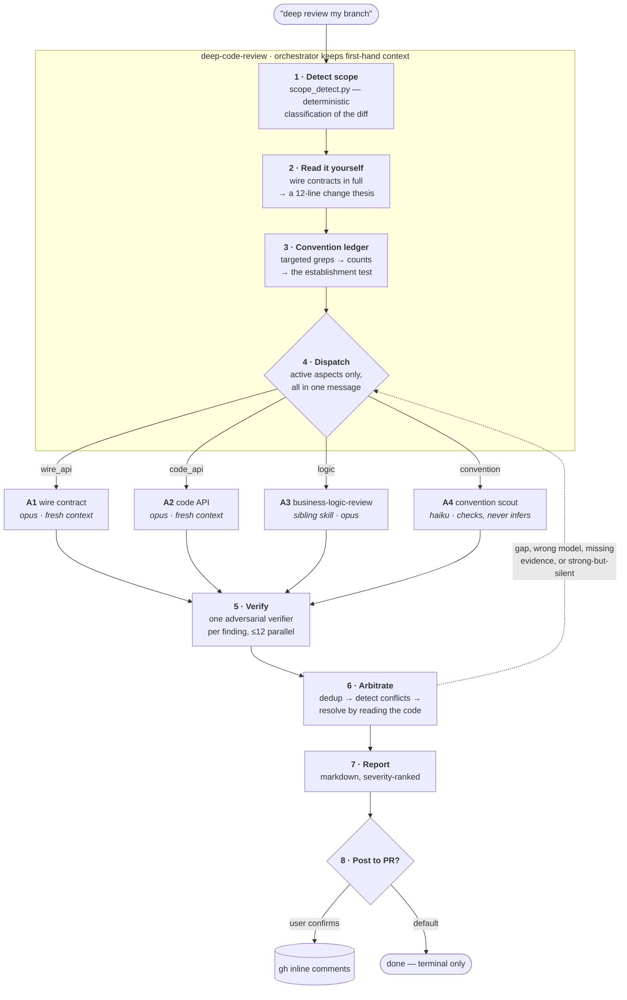
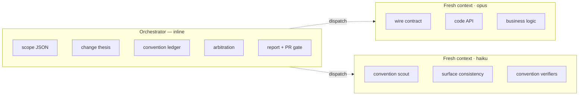
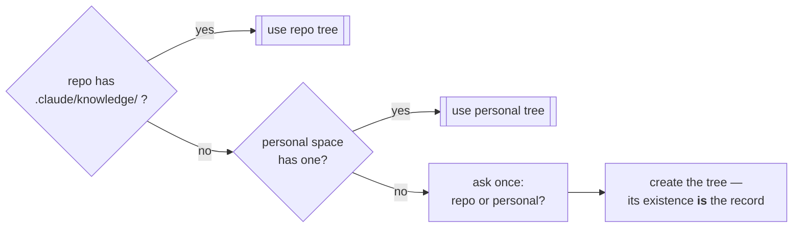

# How deep-code-review works

A review skill for the judgment calls tooling can't make: **is this API one we'll
regret**, **does this logic handle the cases the author didn't think of**, and **does this
code look like it belongs in this repo**.

It's built around two failure modes that make design review hard.

**Noise.** A reviewer with no sense of what the repo already does will invent conventions,
cite patterns that don't exist, and bury three real findings under twenty opinions. So
conventions are *measured*, and each aspect only runs if the branch touches it.

**Hallucination.** An agent that can't verify a claim asserts it confidently anyway. So
every finding is anchored to a line quoted from the current tree, and adversarially
checked before it reaches the report.

---

## The pipeline



The dotted line is round 2. It fires at most once, dispatches at most two agents with
narrow questions, and its output skips arbitration — so it can't create a conflict that
would justify a round 3. Anything still unresolved gets disclosed rather than re-litigated.

## Gating is what makes it affordable

`scripts/scope_detect.py` classifies every changed file by role and emits signals, then
activates aspects from that. Only source and wire-contract lines count toward size — so a
1,000-line lockfile churn can't activate business-logic review or inflate the cost shape.

| Branch | Aspects active | Agents |
|---|---|---|
| dependency bump | none | **0** — reports the major bumps and stops |
| small bugfix | logic | 1–2 |
| new feature with a proto | all four | ~12 |
| large refactor | all four, sharded | 25–35 |

## Who does what, and why



The split follows one rule: **work that requires first-hand knowledge stays inline; work
that benefits from a clean slate goes out.**

The orchestrator reads the change itself in Steps 2–3 because in Step 6 it has to settle
disagreements. An arbiter whose only knowledge of the change is a subagent's summary can't
resolve *"A says this violates the pattern, B says this **is** the pattern"* — it can only
pick whichever agent sounded more certain.

The cheap tier gets the convention scout for a specific reason. Small models **check**
explicit rules well and **infer** them badly. So the inferring (Step 3, with counts) stays
with the orchestrator, and the scout is handed a finished ledger and asked only to find
violations. That seam is what makes the cheap tier viable at all.

## Conventions are measured, not assumed

> ≥3 supporting occurrences and ≤1 counterexample → **established**, findings allowed.
> Ratio under 3:1 → **mixed**, becomes a note about repo inconsistency.
> Fewer than 3 → **absent**, no finding, ever.

This exists because the obvious-looking convention is often wrong. In the eval repo, two
modules alphabetize their declarations and a third doesn't — so "this repo alphabetizes"
is a finding the codebase itself contradicts, and filing it costs credibility on the other
nine findings. A `mixed` verdict means *both sides lose*.

## Two verdict vocabularies

Verification is adversarial: the verifier's job is to *disprove* the finding, and it
survives only if that fails. But which way uncertainty falls depends on the kind of claim.

| Aspect | Verdicts | Uncertainty → |
|---|---|---|
| business logic | `CONFIRMED` · `PLAUSIBLE` · `REFUTED` | **REFUTED**, dropped |
| API design, conventions | `GROUNDED` · `TASTE` · `REFUTED` | **TASTE**, demoted but kept |

The asymmetry is the point. A false bug report costs the reader more than a missed one,
because it burns trust in the whole report — so logic findings must earn their place. But
scoring *design* findings on confidence and filtering the low ones deletes the entire
aspect, since a taste judgment never scores high. Demoting keeps the observation available
to a human who can weigh it.

## Severity and fix clarity are independent

Severity is **impact**, never confidence — how sure anyone is already lives in the verdict.

Fix clarity answers the reader's other question: *can I deal with this now, or does this
need a conversation?* **MECHANICAL** (anyone applies it), **SCOPED** (clear what to do,
several ways to do it), **NEEDS-DECISION** (needs a human product call, and carries the
open question).

Ordering is severity descending, then **mechanical fixes first** within each band — a
reader who gets three quick wins arrives at the hard one still engaged. The one override:
CRITICAL or HIGH findings needing a decision are pinned to the very top, because they're
the only ones with human latency in them.

## The shared knowledge base

Business-logic review needs domain *intent*, and intent isn't in the diff. So it
accumulates — under rules strict enough that it never becomes a hallucination amplifier.



```
.claude/knowledge/
├── INDEX.md            L0 · routing — the only unconditional read
├── architecture.md     L1 · high-level map          } repo-index
├── conventions.md      L1 · patterns + counts       }
├── domains/<slug>.md   L2 · intent, lifecycle, invariants, taint, open questions
├── files/<path>.md     L3 · per-file memos          } repo-index
└── review/findings/    ..... open ledger + refutation graveyard
```

Layers link downward so a reader picks its own depth: *"does this diff touch alerting?"*
reads thirty lines; hunting a lifecycle bug reads L0 → L2.

**The rule that makes it safe:** memory stores *pointers and questions, never evidence.*
An entry says where to look and what to ask; a finding's evidence is always code quoted
from the current tree this session. So a stale entry can at worst waste a lookup — it
cannot produce a wrong finding.

Staleness decays by **change, not time**: each claim is anchored to a file, a line, and a
durable quote, and one `git log` plus one `rg` per claim sorts them into FRESH / DRIFTED /
BROKEN. Age doesn't correlate with truth, and time-based expiry would delete exactly the
human-confirmed entries that are expensive to rebuild.

Provenance decides what may be written at all. Observations from code are free; **intent**
claims reach active status only from a human's own words or a test. An agent's guess about
intent is never written as a claim — it becomes an open question with a proposed answer,
which the next review can put to a human. When they answer, it becomes confirmed intent
with their words attached. **That loop is why this improves across reviews rather than
just growing.**

## Files

| Path | What |
|---|---|
| `SKILL.md` | the orchestrator — 8 steps |
| `scripts/scope_detect.py` | deterministic diff classification, JSON out |
| `agents/*.md` | role files loaded into subagent prompts |
| `references/severity-rubric.md` | finding schema, severity, fix clarity, ordering |
| `references/false-positives.md` | exclusions, given to finders *and* verifiers |
| `references/convention-probes.md` | per-language grep recipes for the ledger |
| `meta/` | design rationale, decision log (including rejections), eval ground truth, improvement checklist, iteration history |

`meta/decisions.md` is the one to read before changing anything — it records what was
rejected and why, which is the part that otherwise gets rediscovered the hard way.
