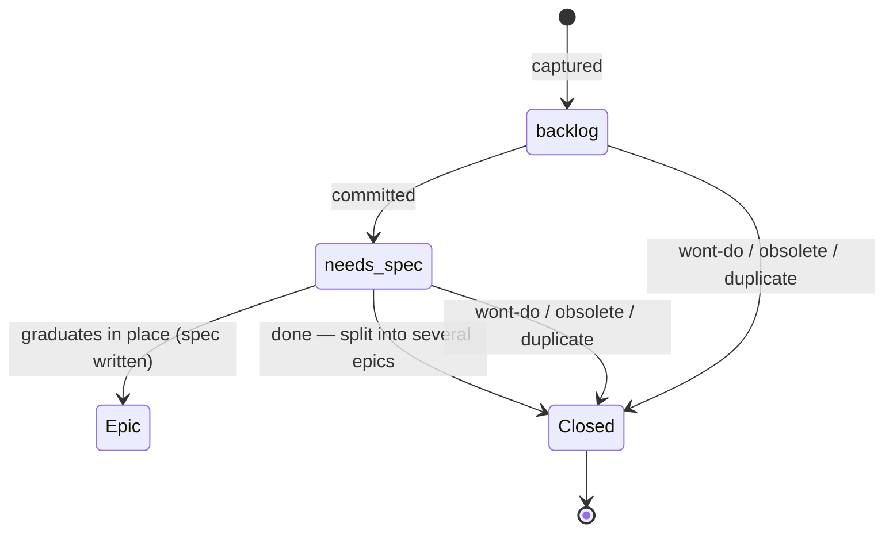
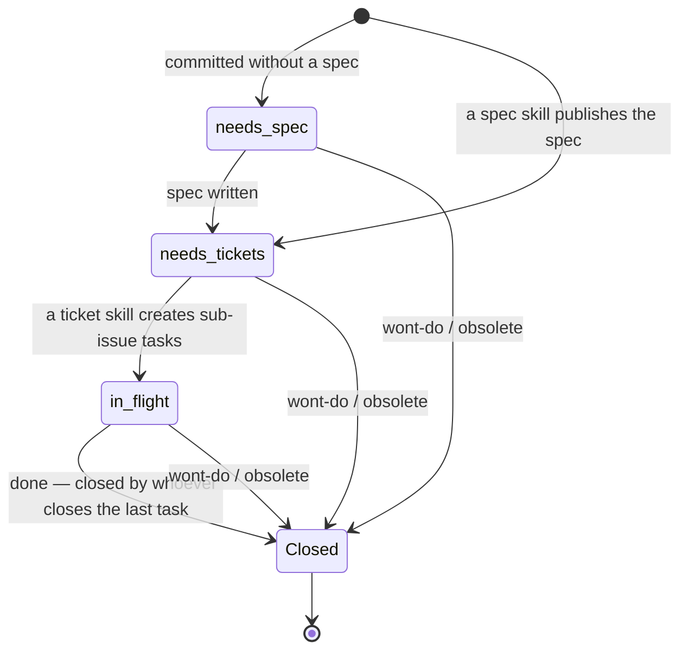
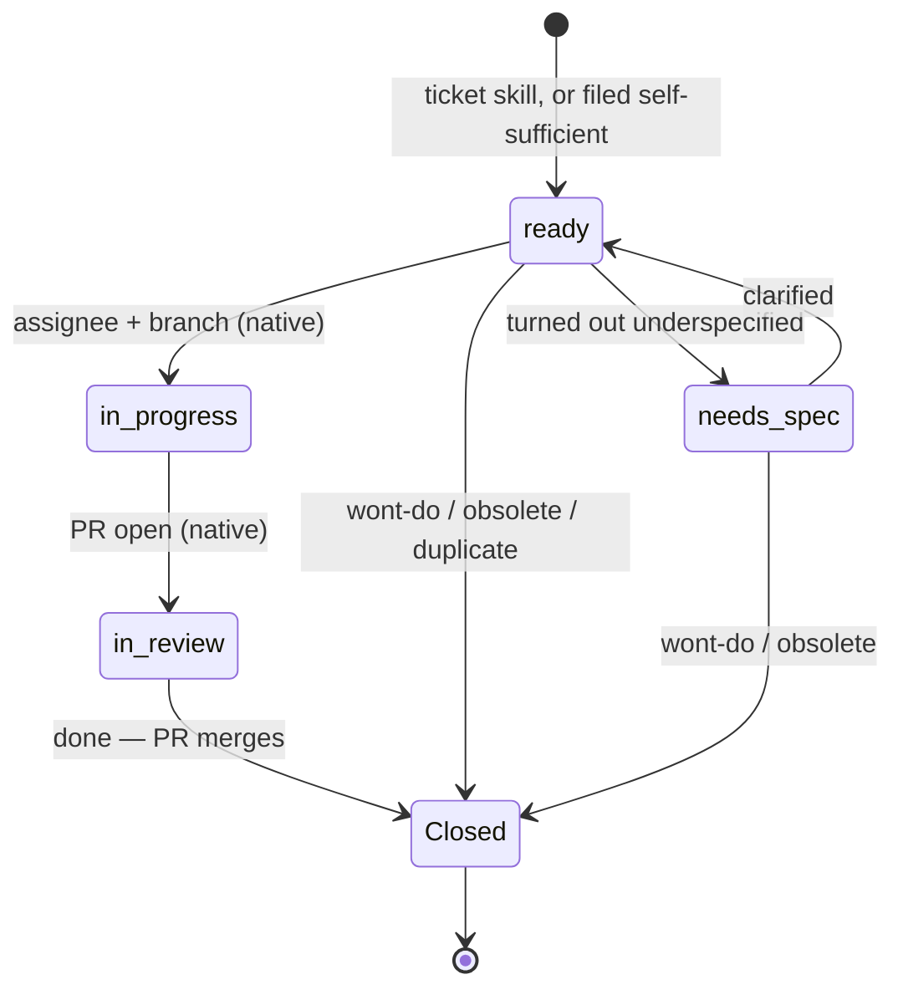
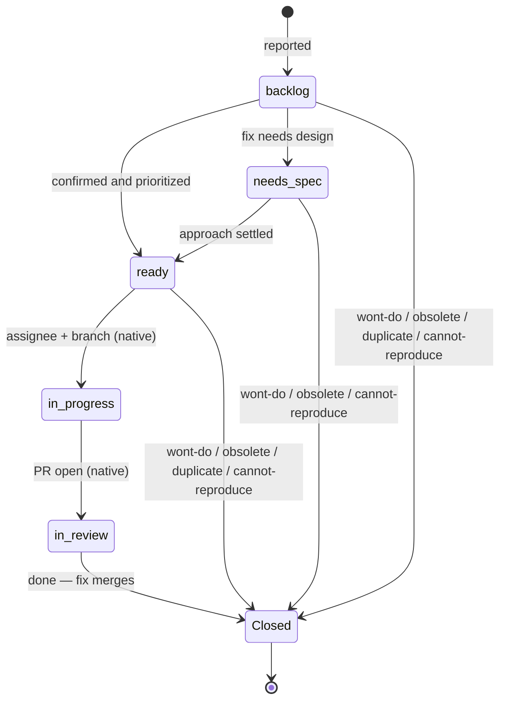

<!-- pm-setup template. Placeholders: {{adr_link}} {{adr_number}} {{area_rows}}
     {{area_growth_note}} {{doc_research}} {{doc_decisions}} {{doc_plans}}
     {{doc_vocabulary}} {{extra_sections}}. Delete this comment when deploying. -->
# Issues and PRs

The working reference for [ADR {{adr_number}}]({{adr_link}}). If the two disagree,
the ADR wins.

## The short version

- Every issue gets exactly one `type/*` label and a matching title prefix:
  `[Epic]`, `[Task]`, `[Bug]`, `[Idea]`.
- Every open issue gets exactly one `status/*` label, and one priority
  (`P0`–`P3`, default `P2`) unless it is an idea.
- Every closed issue gets exactly one `resolution/*` label saying why.
- Tasks are native sub-issues of their epic. Ideas graduate in place.
- PR bodies start with `Closes #N` or `Part of #N`; PR titles start with
  `[#N]`. Trivial fixes are exempt.
- Issues are thin pointers; research, decisions, plans and vocabulary live
  in the repo.

## Labels

### type — what kind of issue this is

| Label | Description |
| --- | --- |
| `type/epic` | Specced body of work; parent of tasks |
| `type/task` | One self-sufficient slice of work |
| `type/bug` | Something built behaves wrongly |
| `type/idea` | Direction or thought; not yet actionable |

There is no story (every task is a vertical slice already) and no chore (a
chore is a task). Regressions are not tracked separately from bugs.

### priority — how urgent, bare names

| Label | Description |
| --- | --- |
| `P0` | Drop everything; actively broken |
| `P1` | Blocks the current goal; next up |
| `P2` | Normal queue (the default) |
| `P3` | Someday; unscheduled |

Ideas carry no priority; priority arrives at graduation. There is no
severity scale (ADR {{adr_number}}).

### area — which part of the system, zero or more

| Label | Description |
| --- | --- |
{{area_rows}}

{{area_growth_note}}

### status — the next deliberate action, exactly one per open issue

| Label | Description |
| --- | --- |
| `status/backlog` | Captured; no commitment yet |
| `status/needs-spec` | Committed; awaiting a spec or grilling session |
| `status/needs-tickets` | Spec done; awaiting task breakdown |
| `status/in-flight` | Tasks exist; work underway |
| `status/ready` | Body is self-sufficient; pick up and execute |

Status labels flip only by deliberate decision. In progress, in review,
blocked and done are **not** labels — GitHub already expresses them
(assignee and an open branch or PR, open PR, dependency edges, closed) and
maintains them itself. The status label freezes when an issue closes.

### resolution — why it closed, exactly one per closed issue

| Label | Description |
| --- | --- |
| `resolution/done` | The work shipped |
| `resolution/wont-do` | Valid, but we choose not to |
| `resolution/obsolete` | Overtaken by events |
| `resolution/duplicate` | Already tracked elsewhere |
| `resolution/cannot-reproduce` | Could not reproduce (bugs) |

The native close reason is derived, never chosen: `done` closes as
completed, everything else as not planned. GitHub's native duplicate close
reason goes unused — close duplicates as not planned with
`resolution/duplicate` and a comment naming the original. An issue
auto-closed by a merged PR has no resolution label yet; closed-as-completed
with no label means `resolution/done`, and the label is backfilled (by the
merger, or by the `/project-manager` audit).

## Palette

Material Design tokens: one color per family for area, status and
resolution; blue shades per label for type; a heat ramp for priority.
Re-theming is an edit here plus a `gh label edit` pass. `type/bug` is the
one deliberate exception to type's blue family: bug-is-red is muscle
memory worth keeping.

| Family | Material token | Hex |
| --- | --- | --- |
| `type/epic` | Blue 700 | `1976D2` |
| `type/task` | Blue 400 | `42A5F5` |
| `type/idea` | Blue 100 | `BBDEFB` |
| `type/bug` | Red 700 | `D32F2F` |
| `P0` | Red 900 | `B71C1C` |
| `P1` | Deep Orange 600 | `F4511E` |
| `P2` | Amber 600 | `FFB300` |
| `P3` | Grey 500 | `9E9E9E` |
| `area/*` | Green 700 | `388E3C` |
| `status/*` | Deep Purple 500 | `673AB7` |
| `resolution/*` | Blue Grey 500 | `607D8B` |

## Invariants

Machine-checkable; the `/project-manager` skill audits them.

- Open issue: exactly one `type/*`, exactly one `status/*`, zero
  `resolution/*`; exactly one of `P0`–`P3` unless `type/idea`.
- Closed issue: exactly one `resolution/*`; status frozen as of closing.
- Title prefix matches the type label.
- An epic's tasks are its native sub-issues; a task has at most one
  parent, and standalone tasks (no epic) are fine. Epics do not nest.

## State machines

States in `status/` are labels; states marked *(native)* are GitHub
signals, not labels. Every close carries a resolution. The diagrams show
the common close paths; abandonment may close from **any** non-terminal
state with the same resolutions.

### Idea



Graduation rewrites the same issue: the spec becomes the body, the
original idea survives as a concise section, `type/idea` becomes
`type/epic`. A new issue is created only when one idea splits into several
epics; the idea then closes `resolution/done` linking its children.

### Epic



GitHub advances the epic's progress bar as sub-issues close but never
closes the parent. Closing the epic with `resolution/done` when its last
task closes is a standing rule — done by whoever closes that task, audited
by `/project-manager` — the same shape as the `resolution/done` backfill.

### Task



A blocked task is a native dependency edge (or a `Blocked by` line in the
body), visible on the issue — not a status. `ready` covers every kind of
work: coding, writing and research, operational chores. The body says
which.

### Bug



## Lifecycle and the skills

| Step | Who | What it stamps |
| --- | --- | --- |
| Capture an idea | anyone | `[Idea]`, `type/idea`, `status/backlog` |
| Commit to it | you | `status/needs-spec` (the grilling queue) |
| Spec it | grilling / a spec skill | body rewritten in place, `type/epic`, `status/needs-tickets`, priority |
| Break it down | a ticket skill | sub-issue tasks with `[Task]`, `type/task`, `status/ready`, priority; epic flips to `status/in-flight` |
| Do the work | anyone | native signals; PR per the conventions below |
| Close | merge / decision | resolution label; native reason derived |

The tracker seam file (`.claude/tracker.md`) tells spec/ticket skills exactly what
to stamp; its instructions override any skill's generic defaults.

Artifacts produced on the way — research notes, ADRs, plans, glossary
entries — land in `{{doc_research}}`, `{{doc_decisions}}`, `{{doc_plans}}` and
`{{doc_vocabulary}}`; the issue links to them instead of restating them.

## PR conventions

- Title: `[#N] component: summary`.
- Body first line: `Closes #N` (creates the Development link; the issue
  closes when the PR merges) or `Part of #N` for partial work. `Part of`
  is a plain mention, not a link — GitHub's only linking keywords are
  close/fix/resolve, and any Development link (keyword or sidebar) closes
  the issue on merge. So never sidebar-link a partial PR; only the PR that
  finishes the issue gets `Closes #N` or a manual link.
- Trivial fixes (typo, comment, formatting) may skip both.
- The shape is in
  [.github/PULL_REQUEST_TEMPLATE.md](../.github/PULL_REQUEST_TEMPLATE.md).

## Useful queries

```sh
gh issue list -l status/needs-spec            # what to grill next
gh issue list -l status/ready                 # what an agent can pick up now
gh issue list -l status/backlog               # captured, not yet committed (ideas, unconfirmed bugs)
gh issue list --search 'label:P0,P1'          # what actually matters now (comma is OR in search; -l is AND)
gh issue list -l type/epic -l status/in-flight  # epics with work underway
gh issue list -s closed -l resolution/wont-do   # what we decided against
gh issue list --search 'is:closed is:issue -label:resolution/done -label:resolution/wont-do -label:resolution/obsolete -label:resolution/duplicate -label:resolution/cannot-reproduce'
                                              # closed issues missing a resolution (audit)
```
{{extra_sections}}
